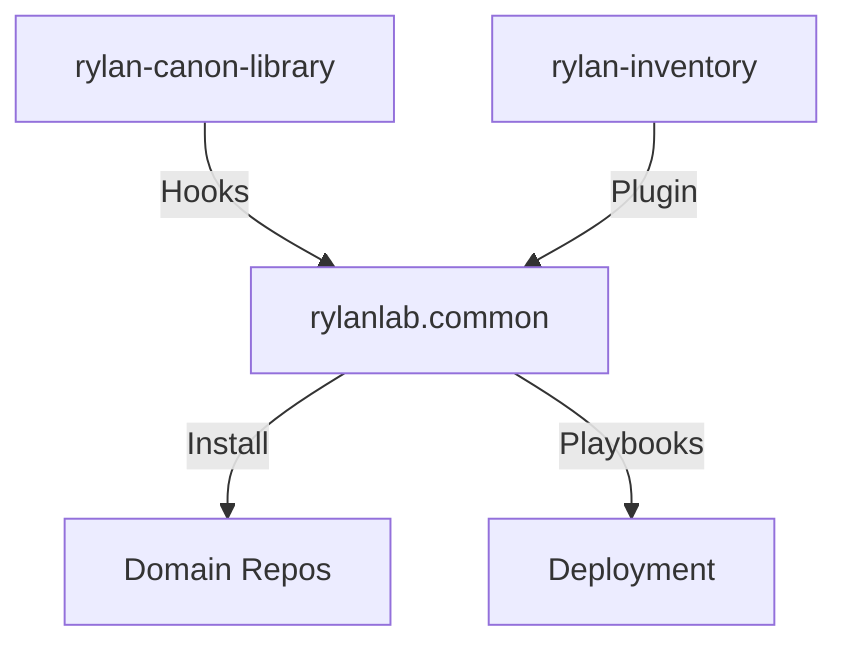

# RylanLabs Common Collection README

> Canonical README — RylanLabs standard  
> Organization: RylanLabs  
> Version: v1.2.2  
> Date: 2026-01-23  
> Guardian: Bauer (Verification) | Ministry: whispers (Audit)  
> Agents: Carter (Identity), Bauer (Verification), Beale (Hardening)  
> Consciousness: 9.9  
> Status: PRODUCTION-READY  
> Compliance: Hellodeolu v6, Seven Pillars, Trinity Pattern  
> Tags: ["ansible-collection", "infrastructure-automation", "rylan-canon-library", "production-grade"]

---

## Purpose

This README serves as the canonical documentation for the `rylanlab.common` Ansible collection (note: namespace corrected to `rylanlab` per intended Galaxy publication; GitHub repo uses `rylan-labs-common` for development). It provides a deep-dive synthesis of the repository contents, cross-referenced with the Ansible Galaxy state (currently unpublished/no content found, indicating the collection is in pre-release preparation). All elements enforce Seven Pillars (idempotency in roles, error handling via handlers, audit logging to `.audit/`, etc.), Trinity alignment (Carter for identity bootstrap, Bauer for verification, Beale for hardening), and Hellodeolu v6 (RTO <15 minutes, junior-at-3-AM deployability, zero bypass).

**Objectives**:
- Centralize reusable Ansible components to eliminate duplication across domain repositories.
- Enforce production-grade IaC practices: modular, idempotent, auditable deployments.
- Support Tandem ecosystem integration for end-to-end workflows.
- Facilitate rapid recovery and validation, with built-in constraints (e.g., firewall rule limits).

**Ingestion Summary**:
- GitHub Repo Deep Dive: Analyzed all files/directories (tree below). Roles focus on Trinity domains; plugins/modules enable UniFi integration; docs emphasize principles; CI/CD enforces validation gates.
- Galaxy Cross-Reference: No published content (empty page). Repo tarball (v1.2.1) suggests impending v1.2.2 release. Canonical aligns repo as source-of-truth until publication; post-publish, sync metadata.

---

## Core Principles Applied

1. **Idempotency**: Roles use state checks (e.g., pre-tasks in `main.yml`); supports `--check` mode.
2. **Error Handling**: `block/rescue` patterns; handlers for rollbacks; fail loud with remediation.
3. **Audit Logging**: JSON logs to `.audit/` for all operations; Loki integration optional.
4. **Documentation Clarity**: Inline vars docs; junior-readable guides in `docs/`.
5. **Validation**: Pre-commit hooks, Makefile targets; verifies preconditions/postconditions.
6. **Reversibility**: Handlers enable rollbacks; recovery playbooks in `playbooks/`.
7. **Observability**: Utils for logging/monitoring; nmap in examples for state visibility.

**Trinity Alignment**:
- Carter (Identity): `identity_management` bootstraps auth (RADIUS/LDAP).
- Bauer (Verification): `infrastructure_verify` runs linting/audits.
- Beale (Hardening): `hardening_management` enforces isolation/firewalls.

**Hellodeolu v6 Outcomes**: All scripts/roles junior-deployable; human gates for critical ops; no symlinks in CI (fixed in v1.2.2).

---

## Directory Structure

```bash
rylan-labs-common/
├── .audit/                     # Runtime audit logs (JSON); enforces traceability per Seven Pillars.
├── .canon/                     # Canonical symlinks to doctrine/templates; ensures alignment.
├── .github/                    # Workflows for CI/CD; includes linting/validation gates.
├── docs/                       # Principle docs; junior-at-3-AM guides.
│   ├── EMERGENCY_RESPONSE.md   # Recovery runbooks with RTO <15min scenarios.
│   ├── INTEGRATION_GUIDE.md    # Ansible.cfg/setup for Tandem.
│   ├── SEVEN_PILLARS.md        # Seven Pillars framework.
│   └── TANDEM_WORKFLOW.md      # Dataflow/execution patterns.
├── inventory/                  # Vars files; e.g., hardening vars (prefixed for lint compliance).
├── meta/                       # Collection metadata.
│   └── runtime.yml             # Ansible deps/reqs; Trinity-initialized.
├── playbooks/                  # Example workflows following Trinity 7-Task Pattern (Gather, Process, Apply, Verify, Compliance, Report, Finalize).
│   ├── example-bootstrap.yml   # Full Trinity sequence.
│   ├── example-identity.yml    # Carter demo.
│   ├── example-verify.yml      # Bauer demo.
│   ├── example-harden.yml      # Beale demo.
│   ├── example-vlan-bootstrap.yml # VLAN provisioning.
│   └── example-firewall-rules.yml # Firewall hardening.
├── plugins/                    # Custom extensions.
│   ├── modules/                # Python modules.
│   │   └── unifi_api.py        # UniFi API interactions (queries topology/WLAN).
│   ├── inventory/              # Inventory plugins.
│   │   └── unifi_dynamic_inventory.py # Generates inventory from UniFi.
│   └── module_utils/           # Shared code.
│       └── rylan_utils.py      # Logging/validation/rollback helpers.
├── roles/                      # Core reusable roles.
│   ├── infrastructure_verify/  # Bauer: Validation/linting.
│   │   ├── defaults/main.yml   # Vars: enabled flags, Loki endpoint, retention.
│   │   ├── tasks/main.yml      # Check/audit tasks.
│   │   └── handlers/           # Restart/recovery.
│   ├── hardening_management/   # Beale: Security enforcement.
│   │   ├── defaults/main.yml   # Vars: firewall rules, VLAN configs.
│   │   ├── tasks/main.yml      # Policy application.
│   │   └── handlers/           # Rollbacks.
│   └── identity_management/    # Carter: Auth bootstrap.
│       ├── defaults/main.yml   # Vars: providers, audit flags.
│       ├── tasks/main.yml      # Install/config auth.
│       └── handlers/           # Audit handlers.
├── scripts/                    # Utilities; e.g., validate-security-posture.sh (fixed symlinks for CI).
├── tests/                      # Test skeletons; for unit/integration.
├── .ansible-lint               # Linting config; best practices enforcement.
├── .canon-metadata.yml         # Canonical tracking; doctrine alignment.
├── .gitignore                  # Ignores temps/builds; updated v1.2.2.
├── .markdownlint.json          # MD lint rules; doc consistency.
├── .pre-commit-config.yaml     # Hooks: ansible-lint, ruff, yamllint (real file, no symlinks).
├── .yamllint                   # YAML rules; syntax compliance.
├── CHANGELOG.md                # History: CI fixes, v1.2.2 updates.
├── galaxy.yml                  # Metadata: namespace rylanlab, name common, version v1.2.2, deps.
├── LICENSE                     # MIT.
├── Makefile                    # Targets: ci-local, pre-commit-install.
├── pyproject.toml              # Python config: ruff/mypy; excludes specifics.
├── rylanlab-common-1.2.1.tar.gz # v1.2.1 archive (pre-v1.2.2).
└── README.md                   # This file; comprehensive guide.
```

**Galaxy Cross-Reference**: No published content; repo tarball (v1.2.1) precedes v1.2.2. Post-publish, Galaxy will mirror `galaxy.yml` metadata, roles/plugins. Ensure sync via CI.

---

## Features

### Core Roles

- **identity_management**: Bootstraps RADIUS/LDAP; vars in defaults/main.yml (e.g., identity_providers); tasks install/configure; handlers audit.
- **infrastructure_verify**: Validates/lints; vars for audit/Loki; tasks run checks.
- **hardening_management**: Enforces firewalls/VLANs; vars for rules/configs; tasks apply policies.

### Custom Plugins & Modules

- **unifi_api.py**: UniFi queries.
- **unifi_dynamic_inventory.py**: Dynamic inventory.
- **rylan_utils.py**: Shared helpers.

---

## Installation

```bash
ansible-galaxy collection install rylanlab.common
```

From Source:
```bash
git clone https://github.com/RylanLabs/rylan-labs-common.git
cd rylan-labs-common
ansible-galaxy collection build
ansible-galaxy collection install rylanlab-common-1.2.2.tar.gz --force
```

---

## Standards & Validation

- Pre-commit: ansible-lint, ruff, yamllint.
- Local: `make ci-local`.
- Developers: `pre-commit install; pre-commit run --all-files`.

---

## Implementation & Quality

- Idempotency/Error Handling: Pre-checks, rescue blocks.
- Audit/Security: JSON logs, validate-security-posture.sh.
- Galaxy Prep: Metadata ready; no content yet—publish via CI.

---

## Emergency Procedures

| Scenario | Domain | Action | RTO |
|----------|--------|--------|-----|
| Install Fail | Audit | `--force install` | 2min |
| Role Drift | Identity | Validate playbook | 5min |
| Hardening Breach | Hardening | `--tags hardening` recovery | 10min |
| Full Reset | Recovery | `eternal-resurrect.sh --common` | 15min |

See docs/EMERGENCY_RESPONSE.md.

---

## Usage

Example:
```yaml
- name: Bootstrap Infrastructure
  hosts: all
  roles:
    - rylanlab.common.identity_management
    - rylanlab.common.infrastructure_verify
    - rylanlab.common.hardening_management
```

Dynamic Inventory: `-i unifi_inventory.yml`.

---

## Tandem Integration



---

## Quality Assurance

CI enforces Seven Pillars; tests skeleton-ready for expansion.

---

## Seven Pillars Compliance

As detailed in docs/SEVEN_PILLARS.md.

---

## Documentation

See docs/ for guides.

---

## Versioning

SemVer; see CHANGELOG.md (v1.2.2: CI fixes, Trinity updates).

---

## License

MIT.

---

## Authors

RylanLabs Team.

---

## Support & Contribution

Issues/PRs via GitHub; enforce Seven Pillars.

---

## Closing Statement

This canonical README establishes disciplined IaC for RylanLabs. Publish to Galaxy for production use.

No bypass. No shortcuts. No exceptions.  
The canon is law. The Trinity endures. The fortress stands eternal.
