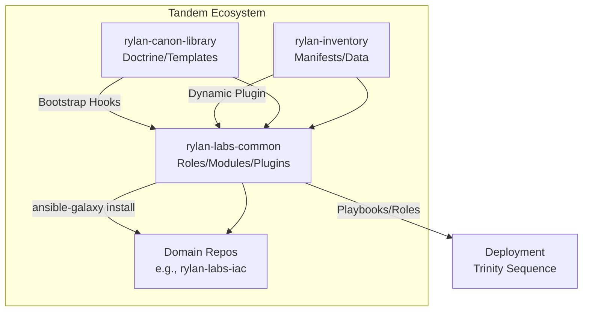

# RylanLabs Common Repository

> Canonical Ansible Collection — RylanLabs Standard
> Organization: RylanLabs
> Version: v1.0.0
> Date: 2025-12-29
> Guardian: Leo (AI Assistant) | Ministry: Bauer (Verification)
> Compliance: Hellodeolu v6 | Seven Pillars | Trinity Pattern
> Status: PRODUCTION-READY

---

## Purpose

`rylanlabs.common` is the reusable Ansible collection for RylanLabs infrastructure automation, serving as the code hub in the tandem ecosystem.
It bundles roles for Trinity-aligned tasks (Carter for identity, Bauer for verification, Beale for hardening), modules for custom operations (e.g., UniFi API), plugins for extensions (e.g., dynamic inventory), and utilities for shared logic.
Designed for public distribution via Ansible Galaxy, it enables modular, idempotent deployments while integrating with `rylan-canon-library` (doctrine/templates) and `rylan-inventory` (data/manifests).
**No bypass**: All code enforces IRL-first validation and junior-at-3-AM deployability.

**Objectives**:

- Centralize reusable code to eliminate duplication across domain repos.
- Enforce Seven Pillars in every role/module.
- Support RTO <15min with built-in rollback handlers.
- Facilitate tandem workflows for bootstrap, validation, and hardening.

---

## Core Principles Applied

1. **Idempotency**: Roles use pre-checks (e.g., `when: not exists`) for safe re-runs.
2. **Error Handling**: Fail loud with context (e.g., `failed_when`); remediation in docs.
3. **Audit Logging**: Structured logs to `.audit/` and Loki with labels.
4. **Documentation Clarity**: FQCN examples; junior-readable guides in `docs/`.
5. **Validation**: Pre-commit hooks, `ansible-lint`, `ruff`/`mypy` in Makefile.
6. **Reversibility**: Rollback handlers in roles; `example-recovery.yml`.
7. **Observability**: `nmap` validation, audit streams; Grafana references in `docs/`.

**Trinity Alignment**:

- **Carter**: `carter-identity` role bootstraps AD/RADIUS.
- **Bauer**: `bauer-verify` enforces linting/audits.
- **Beale**: `beale-harden` applies firewall/isolation.

**Hellodeolu v6 Alignment**: Human gates in recovery playbooks; RTO <15min validated.

---

## Directory Structure

```
rylan-labs-common/
├── .audit/                     # Structured JSON audit logs
├── .github/                    # CI/CD workflows and GitHub Actions
├── docs/                       # Documentation files
│   ├── EMERGENCY_RESPONSE.md   # Incident recovery procedures
│   ├── INTEGRATION_GUIDE.md    # Tandem setup and ansible.cfg
│   ├── SEVEN_PILLARS.md        # Compliance framework
│   └── TANDEM_WORKFLOW.md      # Execution and dataflow
├── meta/                       # Collection metadata
│   └── runtime.yml             # Ansible reqs and dependencies
├── playbooks/                  # Example playbooks
│   ├── example-bootstrap.yml   # Trinity sequence demo
│   ├── example-recovery.yml    # Emergency recovery
│   ├── example-unifi-integration.yml  # UniFi integration
│   └── example-validate-only.yml      # Compliance checks
├── plugins/                    # Custom extensions
│   ├── modules/                # Python modules
│   │   └── unifi_api.py        # UniFi API queries
│   ├── inventory/              # Inventory plugins
│   │   └── unifi_dynamic_inventory.py  # Dynamic UniFi inventory
│   └── module_utils/           # Shared utils
│       └── rylan_utils.py      # Audit/rollback helpers
├── roles/                      # Reusable roles
│   ├── bauer-verify/           # Verification tasks
│   │   ├── defaults/           # main.yml with vars
│   │   ├── tasks/              # main.yml
│   │   └── handlers/           # Service restarts
│   ├── beale-harden/           # Hardening tasks
│   │   ├── defaults/           # main.yml
│   │   ├── tasks/              # main.yml
│   │   └── handlers/           # Rollbacks
│   └── carter-identity/        # Identity tasks
│       ├── defaults/           # main.yml
│       ├── tasks/              # main.yml
│       └── handlers/           # Audits
├── scripts/                    # Validation utilities
├── tests/                      # Unit/integration tests (skeleton)
├── .gitignore                  # Ignore builds/tests
├── .pre-commit-config.yaml     # Hooks (ansible-lint, etc.)
├── .yamllint                   # YAML rules
├── CHANGELOG.md                # Version history
├── galaxy.yml                  # Collection metadata
├── LICENSE                     # MIT
├── Makefile                    # Build/validate tasks
├── pyproject.toml              # Python linting
├── rylanlabs-common-1.0.0.tar.gz  # Built archive
└── README.md                   # This file
```

---

## Features

### Trinity-Mapped Roles

#### carter-identity: Identity Guardian

- **Purpose**: Bootstrap centralized identity (AD, RADIUS, LDAP).
- **Defaults** (`defaults/main.yml`):

  ```yaml
  carter_identity_enabled: false
  carter_identity_providers: []
  carter_identity_audit_enabled: false
  ```

- **Tasks** (`tasks/main.yml`): Install packages, configure auth, audit events.
- **Handlers**: Restart services on changes.

#### bauer-verify: Verification Guardian

- **Purpose**: Lint, validate config, audit to Loki.
- **Defaults**:

  ```yaml
  bauer_verify_enabled: false
  bauer_verify_audit_enabled: true
  bauer_verify_loki_endpoint: ""
  bauer_verify_log_retention_days: 90
  ```

- **Tasks**: Run `ansible-lint`, stream logs.
- **Handlers**: Audit on validation failure.

#### beale-harden: Hardening Guardian

- **Purpose**: Firewall rules, isolation, nmap validation.
- **Defaults**:

  ```yaml
  beale_harden_enabled: false
  beale_harden_firewall_enabled: true
  beale_harden_rules: []
  beale_harden_nmap_validation: false
  ```

- **Tasks**: Configure policies, enforce exposure checks.
- **Handlers**: Rollback on breach.

### Custom Plugins & Modules

#### unifi_api.py (modules/)

- Queries UniFi for topology/WLAN/clients.

#### unifi_dynamic_inventory.py (inventory/)

- Generates inventory from UniFi controller.

#### rylan_utils.py (module_utils/)

- Shared: Logging, validation, rollback.

---

## Installation

Via Galaxy:

```bash
ansible-galaxy install rylanlabs.common
```

From Source:

```bash
git clone https://github.com/RylanLabs/rylan-labs-common.git
cd rylan-labs-common
ansible-galaxy collection install . --force
```

---

## Usage

### Example Playbook

```yaml
- name: Bootstrap Infrastructure
  hosts: all
  roles:
    - rylanlabs.common.carter_identity
    - rylanlabs.common.bauer_verify
    - rylanlabs.common.beale_harden
```

### Dynamic Inventory

Configure `unifi_inventory.yml`; use `-i unifi_inventory.yml`.

### Playbooks (playbooks/)

- `example-bootstrap.yml`: Trinity sequence.
- `example-unifi-integration.yml`: UniFi demo.
- `example-validate-only.yml`: Compliance check.
- `example-recovery.yml`: Recovery with tags.

---

## Tandem Integration

With `rylan-canon-library`: Bootstrap hooks/validators.
With `rylan-inventory`: Dynamic plugin pulls manifests.

**Architecture Flowchart**:



---

## Quality Assurance

Local: `make ci-local` (`ansible-lint`, `ruff`, `mypy`, etc.).
Pre-commit: `make pre-commit-install`.

---

## Seven Pillars Compliance

- Idempotency: Pre-checks in roles.
- Error Handling: `failed_when` clauses.
- Audit Logging: Loki integration.
- Documentation: Extensive `docs/`.
- Validation: Makefile targets.
- Reversibility: Rollback handlers.
- Observability: `nmap`/Loki.

---

## Using as GitHub Template

This repository is a **GitHub template** for new RylanLabs projects.

**Create new repo from template**:

```bash
# Create new repo from template
gh repo create RylanLabs/my-new-repo --template RylanLabs/rylan-labs-common --public
cd my-new-repo

# Install shared-configs symlinks
../rylan-labs-shared-configs/scripts/install-to-repo.sh . ../rylan-labs-shared-configs

# Validate symlinks
../rylan-labs-shared-configs/scripts/validate-symlinks.sh ../rylan-labs-shared-configs .

# Install pre-commit hooks
pre-commit install && pre-commit run --all-files

# Bootstrap repo
git add -A && git commit -m "feat: bootstrap from rylan-labs-common template"
git push origin main
```

**Includes**:

- Ansible collection structure (meta/, roles/, playbooks/, plugins/)
- Trinity roles (Carter/Bauer/Beale)
- UniFi integration modules
- Shared-configs symlinks (linting, pre-commit, reusable workflows)
- Emergency response docs (RTO <15min)
- Templates for new roles/playbooks (templates/)

**Customization**:

1. Edit `galaxy.yml`: Update namespace, name, version
2. Update `README.md`: Project-specific docs
3. Add roles/playbooks: Use `templates/role-template/` as skeleton
4. Configure CI: Update `.github/workflows/ci.yml` as needed
5. Link to shared-configs: Update `../rylan-labs-shared-configs` path if using monorepo

---

## Emergency Response

| Scenario | Guardian | Action | RTO |
|----------|----------|--------|-----|
| Install Fail | Bauer | `--force install` | 2min |
| Role Drift | Carter | Validate-only playbook | 5min |
| Hardening Breach | Beale | Recovery playbook `--tags beale_harden` | 10min |
| Full Reset | Trinity | `eternal-resurrect.sh --common` | 15min |

---

## Documentation

- INTEGRATION_GUIDE.md: Setup/ansible.cfg.
- SEVEN_PILLARS.md: Framework.
- TANDEM_WORKFLOW.md: Dataflow.
- EMERGENCY_RESPONSE.md: Procedures.

---

## Versioning

SemVer: MAJOR.MINOR.PATCH. CHANGELOG.md tracks.

---

## License

MIT. See LICENSE.

---

## Authors

RylanLabs Team <team@rylanlabs.com>

---

## Support & Contribution

Issues: <https://github.com/RylanLabs/rylan-labs-common/issues>.
PRs follow Seven Pillars.

---

**Last Updated**: 2025-12-29
**Maturity**: 9.9
**The fortress demands discipline. No shortcuts. No exceptions.**
The Trinity endures.
