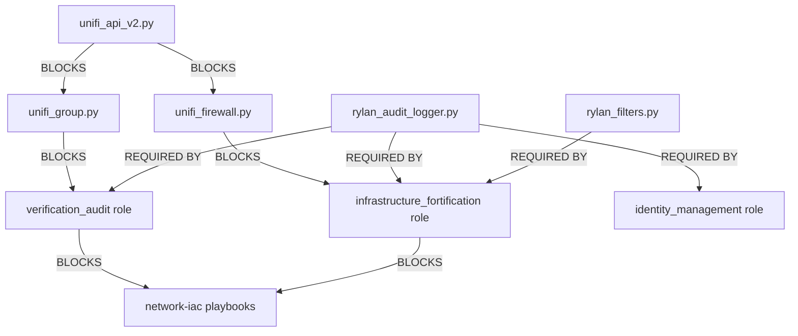

# RylanLabs Common Collection: Extraction Roadmap (v2.0.0)

This document outlines the canonical path for extracting logic from domain repositories (e.g., `network-iac`) into the `common` collection.

## Dependency Graph

## Phase-Based Priority Matrix

| Tier | Priority | Component | Dependency |
| :--- | :--- | :--- | :--- |
| **TIER 1** | **CRITICAL** | `rylan_audit_logger.py` | None |
| **TIER 1** | **CRITICAL** | `unifi_api_v2.py` | `rylan_audit_logger` |
| **TIER 2** | **HIGH** | `unifi_group.py` | `unifi_api_v2` |
| **TIER 2** | **HIGH** | `verification_audit` | `unifi_group` |
| **TIER 3** | **MEDIUM** | `identity_management` | `rylan_audit_logger` |
| **TIER 3** | **MEDIUM** | `infrastructure_fortification` | `unifi_firewall` |
| **TIER 4** | **LOW** | `adversarial_simulation` | None |

## Guardians of the Extraction
- **Carter**: Identity & Authentication logic extraction.
- **Bauer**: Audit & Drift detection logic migration.
- **Beale**: Hardening & Firewall CRUD standardization.
- **Whitaker**: New adversarial testing implementation.

## Success Criteria
- ✅ v1.x legacy roles deprecated and archived.
- ✅ All extracted components pass `make validate`.
- ✅ No absolute file paths in any extracted scripts or roles.
- ✅ Seven Pillars compliance verified for every component.
